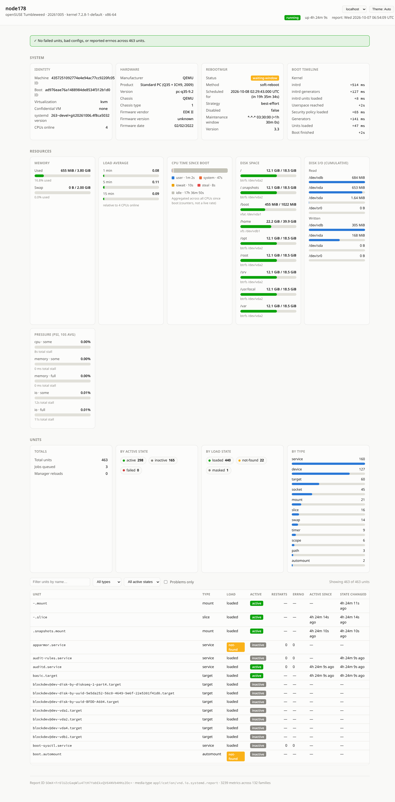

# sd-report-collector

Server counterpart to `systemd-report upload`
(see [systemd-report](https://manpages.opensuse.org/systemd-report.1)).
Accepts report pushes over mTLS, stores each one zstd-compressed under a
per-hostname directory, and runs configured plugins against the saved file.

## Build

Requires `libeconf` development headers (`libeconf-devel` / `libeconf-dev`)
and a C compiler, since configuration parsing uses cgo bindings to libeconf.

```
meson setup build
meson compile -C build
meson test -C build
```

## Quickstart

Generate the CA, server cert, and a client cert under /etc/sd-report-collector and start the service:

```sh
sd-report-certs init
sd-report-certs client myhost.example.com

systemctl start sd-report-collector.service
```

On the client call `systemd-report`:
```sh
/usr/lib/systemd/systemd-report upload --url=https://<server>:8443/report --cert=/etc/sd-report-collector/clients/myhost.pem --key=/etc/sd-report-collector/clients/myhost.key --trust=/etc/sd-report-collector/ca.pem
```

## Configuration

See `dist/sd-report-collector.conf` for all keys and their defaults.

## Certificate management

`sd-report-certs` generates the CA, server certificate, and client
certificates needed for mTLS, storing everything below
`/etc/sd-report-collector`:

```
sd-report-certs init          # generates ca.pem/ca.key and server.pem/server.key
sd-report-certs client myhost # generates clients/myhost.pem and clients/myhost.key,
                              # signed by the CA from init
```

`init` must be run once (as root, since it writes under `/etc`) before any
`client` certificates can be issued. Both subcommands refuse to overwrite
existing files unless `--force` is given; forcing `init` invalidates every
certificate previously signed by that CA. `init` also writes
`sd-report-collector.conf.d/certgen.conf`, a config drop-in pointing
`ServerCertificateFile`, `ServerKeyFile`, and `ClientCAFile` at the generated
`server.pem`/`server.key`/`ca.pem`.
Each `clients/<name>.pem`/`clients/<name>.key` pair needs to be copied to
the matching client (`myhost` here matches the hostname systemd-report will
report as).

## Dashboard plugin

`sd-report-dashboard` is an sd-report-collector plugin that renders a saved
report as a static, self-contained HTML dashboard. Point a `[Plugins]` entry
at the built binary:

```
[Plugins]
dashboard=/usr/lib/sd-report-collector/sd-report-dashboard
```

It writes `<OutputDirectory>/<hostname>.html`, overwriting that host's
dashboard in place each time a new report arrives. The HTML template is
compiled into the binary, but can be overriden via a snippet in
`/etc/sd-report-collector/sd-report-collector.conf.d/`:

```
[Dashboard]
OutputDirectory=/srv/www/html/dashboards
TemplateFile=/etc/sd-report-dashboard/dashboard_template.html
DescribeFile=/etc/sd-report-dashboard/report.describe
```

`TemplateFile` and `DescribeFile` are optional; leaving them unset uses the
built-in template and omits per-metric type/description annotations,
respectively. `DescribeFile` should point at the output of
`systemd-report describe`.



## InfluxDB plugin and Grafana dashboard

`sd-report-influxdb` is an sd-report-collector plugin that exports a saved
report's metrics to InfluxDB, so they can be graphed over time in Grafana.
Point a `[Plugins]` entry at the built binary:

```
[Plugins]
influxdb=/usr/lib/sd-report-collector/sd-report-influxdb
```

and configure the InfluxDB server to write to:

```
[InfluxDB]
Server=influxdb.example.com
Bucket=sd-report-collector
Organization=my-org
Token=<token>
```

`Token` can also be supplied via the `INFLUXDB_TOKEN` environment variable
instead of the config file. See `dist/sd-report-collector.conf` for all keys
and their defaults.

Each metric family becomes an InfluxDB measurement (e.g.
`io.systemd.Basic.LoadAverage1Min`), with its value written to a single
`value` field. The report's hostname and the metric's `object` (if any, e.g.
a unit name, mount point, or device) and label fields (e.g. `type`,
`resource`, `source`) become tags. The report's own report ID is
intentionally not stored, since it is unique per upload and would otherwise
explode series cardinality.

Metric families can be excluded from export with `ExcludeMetrics`, a
comma-separated list of patterns matched against the family name, e.g.:

```
[InfluxDB]
ExcludeMetrics=io.systemd.Manager.*,io.systemd.Basic.CPUUsage
```

A pattern ending in `*` excludes every family with that prefix (here, the
whole `io.systemd.Manager` family, covering per-unit timestamps and state
noise most dashboards don't need); any other pattern must match a family
name exactly.

`dist/grafana-dashboard.json` is a ready-to-import Grafana dashboard built
around that layout, covering the same ground as the HTML dashboard above:
system identity and reboot status, memory/swap/load/CPU/pressure over time,
disk space and I/O, and unit counts by state, type, and load state. Import it
via Grafana's "Import dashboard" screen, pick an InfluxDB datasource
configured with Flux as its query language, and set the `bucket` dashboard
variable to match `[InfluxDB] Bucket` above (it defaults to
`sd-report-collector`). The `host` variable then lists the hosts found in
that bucket.

## Todo

* Verify the report signature
  * by the collector before writing to disk
  * by the plugin and add result to html output
